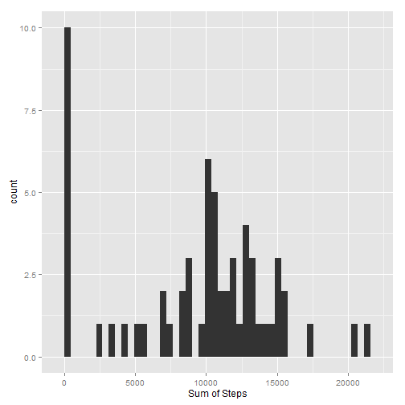
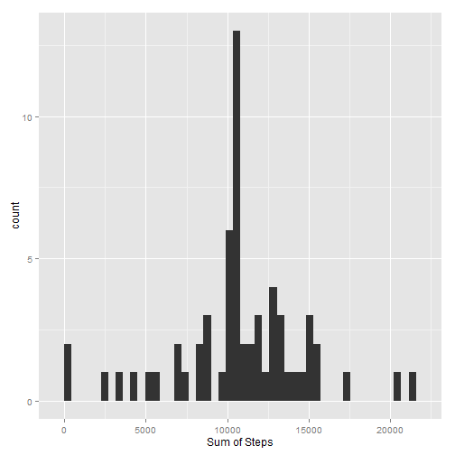
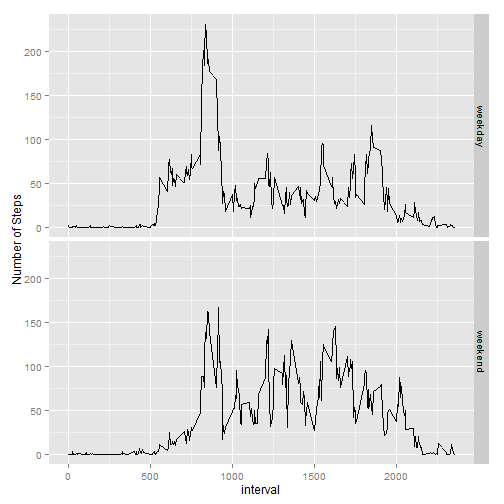

## Requirements
Please make sure you have dplyr, ggplot2 and lubridate package loaded

```r
library(dplyr)
library(ggplot2)
library(lubridate)
```

## Loading and preprocessing the data
Loading the file and reformat date column to date format

```r
activity <- read.csv("./Data//activity.csv")
activity <- mutate(activity,date = as.POSIXct(date, format="%Y-%m-%d"))
```

## What is mean total number of steps taken per day?

1. Create a grouping by date
2. Summarize the steps
3. Draw histogram of steps by day

```r
activity_group <- group_by(activity,date)
sumStepsByDay <- summarize(activity_group, sumSteps = sum(steps, na.rm = TRUE))
qplot(sumSteps, data = sumStepsByDay, xlab = "Sum of Steps", binwidth = 450)
```

 

Show Summary statistics

```r
summary(sumStepsByDay$sumSteps)
```

```
##    Min. 1st Qu.  Median    Mean 3rd Qu.    Max. 
##       0    6778   10400    9354   12810   21190
```

## What is the average daily activity pattern?
Time series plot of the 5-minute interval (x-axis) and the average number of steps taken, averaged across all days (y-axis)

1. Create a grouping by interval
2. Creating the mean by interval accross all days
3. Draw time series plot

```r
activityIntervalGroup <- group_by(activity,interval)
meanStepsbyInterval <- summarize(activityIntervalGroup, meanSteps = mean(steps, na.rm = TRUE))
plot(meanStepsbyInterval$interval,meanStepsbyInterval$meanSteps,type="l", xlab = "5-minute interval", 
        ylab="Average number of steps")
```

 

Showing the intervals with the maximum number of steps

```r
arrange(meanStepsbyInterval,desc(meanSteps))
```

```
## Source: local data frame [288 x 2]
## 
##    interval meanSteps
## 1       835  206.1698
## 2       840  195.9245
## 3       850  183.3962
## 4       845  179.5660
## 5       830  177.3019
## 6       820  171.1509
## 7       855  167.0189
## 8       815  157.5283
## 9       825  155.3962
## 10      900  143.4528
## ..      ...       ...
```

## Imputing missing values
Show summary and Missing Values (NA's)

```r
summary(activity)
```

```
##      steps             date                        interval     
##  Min.   :  0.00   Min.   :2012-10-01 00:00:00   Min.   :   0.0  
##  1st Qu.:  0.00   1st Qu.:2012-10-16 00:00:00   1st Qu.: 588.8  
##  Median :  0.00   Median :2012-10-31 00:00:00   Median :1177.5  
##  Mean   : 37.38   Mean   :2012-10-30 23:32:27   Mean   :1177.5  
##  3rd Qu.: 12.00   3rd Qu.:2012-11-15 00:00:00   3rd Qu.:1766.2  
##  Max.   :806.00   Max.   :2012-11-30 00:00:00   Max.   :2355.0  
##  NA's   :2304
```


A new dataset tidyActivity is created, which replaces NA values with the mean of the steps by interval.

```r
tidyActivity <- group_by(activity,interval) %>% mutate(runningmean=mean(steps,na.rm=TRUE)) %>% mutate(steps=ifelse(is.na(steps),runningmean,steps)) %>%
        select(steps,date,interval)
```

Create histogram for tidydataset:

1. Create a grouping by date
2. Summarize the steps
3. Draw histogram of steps by day

```r
tidyActivityGroup <- group_by(tidyActivity,date)
tidyActivitySumStepsGroup <- summarize(tidyActivityGroup, sumSteps = sum(steps, na.rm = TRUE))
qplot(sumSteps, data = tidyActivitySumStepsGroup, xlab = "Sum of Steps", binwidth = 450)
```

 

Show Summary statistics

```r
summary(tidyActivitySumStepsGroup$sumSteps)
```

```
##    Min. 1st Qu.  Median    Mean 3rd Qu.    Max. 
##      41    9819   10770   10770   12810   21190
```

###Conclusion
*Do these values differ from the estimates from the first part of the assignment?*

Yes, the minimum, 1.st Qu., Median, Mean and 3rd Qu are different.

*What is the impact of imputing missing data on the estimates of the total daily number of steps?*

The number of steps both median and mean increased.

## Are there differences in activity patterns between weekdays and weekends?

Time series plot of the 5-minute interval and the average number of steps taken, averaged across all weekday days or weekend days.

1. Create a factor variable with the levels "weekend" and "weekday"
2. Create grouping by in interval
3. Summarize the mean of steps
4. Plot Panel by weekday or weekend

```r
tidyActivity <- mutate(tidyActivity, dayType = factor(ifelse((wday(date)==1|wday(date)==7),"weekend","weekday")))
tidyActivityGroup <- group_by(tidyActivity,dayType, interval)
meanStepsByInterval <- summarize(tidyActivityGroup, meanSteps = mean(steps))
qplot(interval, meanSteps, data = meanStepsByInterval, facets = dayType ~ ., geom = "line", ylab ="Number of Steps")
```

 


